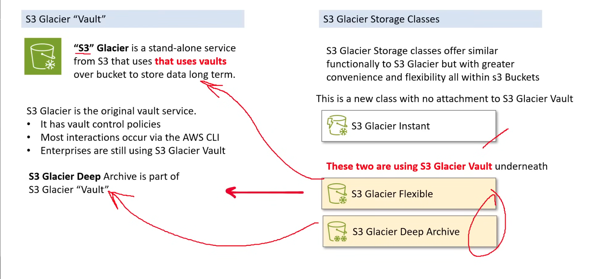
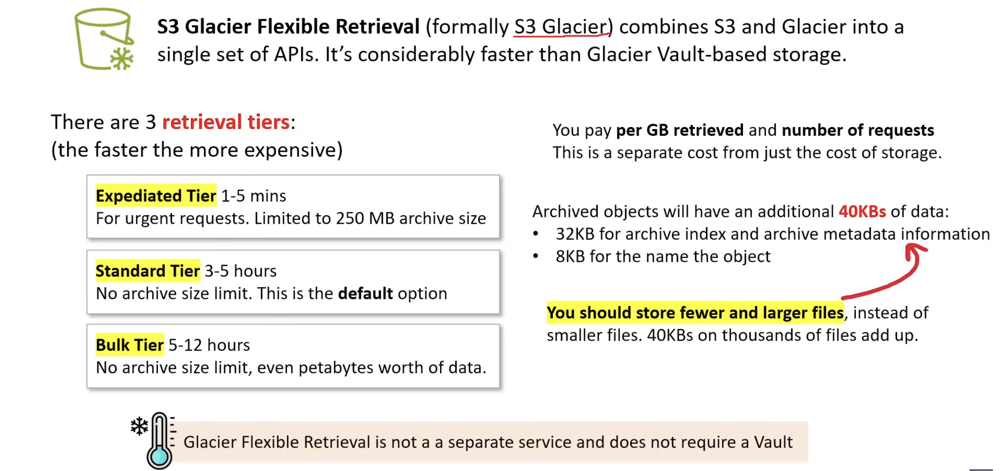
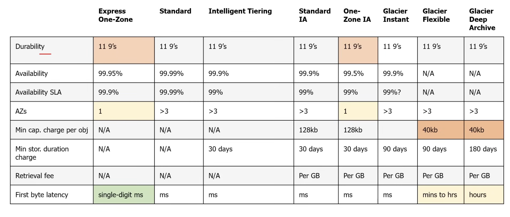

## Create a bucket

```sh
aws s3 mb s3://change-class-funbucket
```
## Create a file

```sh
echo "Hi this is for storage class" > myfile.txt
```

## Upload file with different storage classes

```sh
aws s3 cp myfile.txt s3://change-class-funbucket/standard-myfile
--storage-class STANDARD
aws s3 cp myfile.txt s3://change-class-funbucket/ia-myfile
--storage-class STANDARD_IA
aws s3 cp myfile.txt s3://change-class-funbucket/onezone-myfile 
--storage-class ONEZONE_IA
aws s3 cp myfile.txt s3://change-class-funbucket/glacier-myfile
--storage-class GLACIER
```

## S3 glacier vault vs glacier storage classes


## S3 glacier flexible



# Storage Class comparison
 